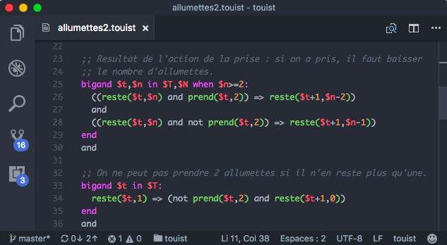

Touist for vscode
=================

Bring syntax coloring and linting to vscode.



This tmLanguage could also be used in other editors (textmate, sublime text) but
I didn't write a package/extension specifically for them; feel free to pick the
tmLanguage for any other editor!

Github source [is here][1].

[1]: https://github.com/touist/touist-vscode

## See warning and errors from touist

You can copy the following code into the `.vscode/tasks.json` file in your project
so that you can use <kbd>shift</kbd> + <kbd>command</kbd> + <kbd>B</kbd> for
ckecking syntax errors in touist files:

```js
{
	"version": "0.1.0",
	"tasks": [{
		"taskName": "build",
		"command": "touist",
        "args": ["--linter", "--qbf", "${relativeFile}", "--wrap-width","0"],
        "isShellCommand": true,
		"problemMatcher": "$touist",
		"showOutput": "always"
	}]
}
```

## Contribute

If you to fix the syntax file `touist.tmLanguage`, you can use the
`touist.YAML-tmLanguage` file to do so and then go into `build` and run

    npm install
    npm start

to compile yaml into tmLanguage. The JSON-tmLanguage is also generated in
case it can help for adding syntax support to an other editor.

To debug the syntax highlighting, you can use the command
**Developer Tools: Inspect TM Tokens**.